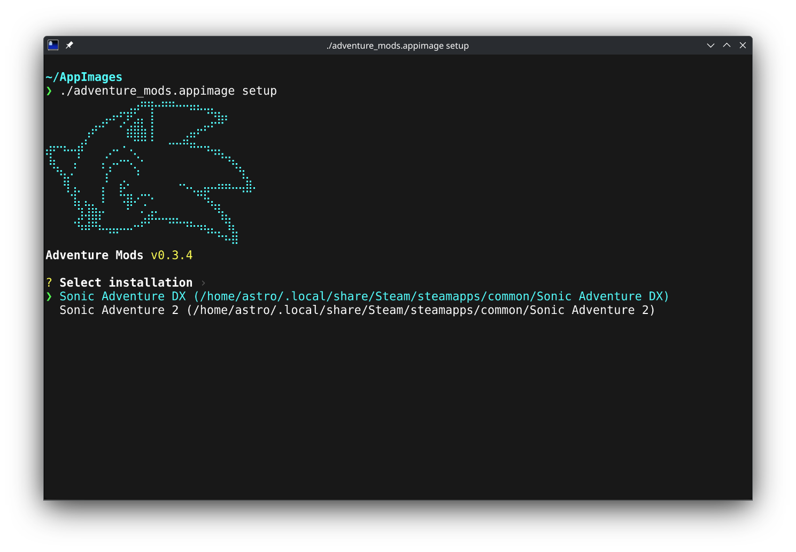

# Adventure Mods

The easiest way to mod Sonic Adventure DX and Sonic Adventure 2 on Linux. Finds your Steam installs, downloads community mods, and handles mod managers, runtimes, resolution, load order, and language settings so you can play right away.

<p align="center">
  
  &nbsp;&nbsp;
  
</p>

## Features

- Detects SADX and SA2 across all Steam library folders
- Includes 29 SADX mods and 12 SA2 mods
- Provides SADX presets: DX Enhanced and Dreamcast Restoration
- Installs mod managers, mods, and dependencies in one step
- Configures native resolution, window mode, and optimal settings
- Saves subtitle and voice language selection per game

## Requirements

- Steam with Sonic Adventure DX (app 71250) and/or Sonic Adventure 2 (app 213610)
- Force **Proton 10.0** for each game under Properties → Compatibility  
  Proton 11 and tools based on it (Hotfix, Experimental, many custom builds such as CachyOS) currently cannot keep SA Mod Manager running.

## Install

**Flatpak (recommended)**

[Install Adventure Mods](https://flatpak.4st.li/apps/io.github.astrovm.AdventureMods/install/), or use the terminal:

```sh
flatpak install --user \
  https://flatpak.4st.li/io.github.astrovm.AdventureMods.flatpakref
```

Update later with `flatpak update`.

<details>
<summary>Other options (AppImage)</summary>

**AppImage with Gear Lever** — [Gear Lever](https://flathub.org/apps/it.mijorus.gearlever)
handles desktop integration and updates:

```sh
flatpak install flathub it.mijorus.gearlever
```

Download the latest AppImage from [GitHub Releases](https://github.com/astrovm/AdventureMods/releases/latest)
and open it with Gear Lever.

**AppImage manually**

```sh
chmod +x AdventureMods-<arch>.AppImage
./AdventureMods-<arch>.AppImage
```

Running without a subcommand launches the GUI. Pass a subcommand for CLI mode.

</details>

## Command line

<p align="center">
  
</p>

Use the installed Flatpak for both the GUI and command line:

```sh
flatpak run io.github.astrovm.AdventureMods [command] [options]
```

Running it without a command opens the GUI. Most users only need the interactive setup:

```sh
flatpak run io.github.astrovm.AdventureMods setup
```

| Command                      | Description                                                  |
| ---------------------------- | ------------------------------------------------------------ |
| `detect`                     | Show detected game installs and inaccessible Steam libraries |
| `list-mods --game sadx\|sa2` | List available presets and mods for a game                   |
| `setup`                      | Install runtimes, mod manager, mods, and config files        |

Examples:

```sh
flatpak run io.github.astrovm.AdventureMods detect
flatpak run io.github.astrovm.AdventureMods list-mods --game sadx
flatpak run io.github.astrovm.AdventureMods setup --game sadx --preset "DX Enhanced"
flatpak run io.github.astrovm.AdventureMods setup --game sa2 --all-mods
```

Use `--help` to see every command and option:

```sh
flatpak run io.github.astrovm.AdventureMods --help
flatpak run io.github.astrovm.AdventureMods setup --help
```

<details>
<summary>Non-interactive setup options</summary>

| Flag                         | Description                                  |
| ---------------------------- | -------------------------------------------- |
| `--game sadx\|sa2`           | Select the game                              |
| `--game-path /path`          | Override Steam detection                     |
| `--preset "Name"`           | Named preset (SADX only)                     |
| `--all-mods`                 | Install all recommended mods                 |
| `--mods slug1,slug2`         | Install specific mods by slug                |
| `--subtitle-language`        | Select subtitles                             |
| `--voice-language`           | Select `japanese` or `english` voices        |
| `--width`, `--height`        | Override the detected resolution             |
| `--libraryfolders-vdf /path` | Use a specific `libraryfolders.vdf` file     |
| `--steam-library /path`      | Add an extra Steam library root (repeatable) |

Subtitle languages:

- SADX: `japanese`, `english`, `french`, `spanish`, `german`
- SA2: `english`, `german`, `spanish`, `french`, `italian`, `japanese`

When game, path, or mod selection is omitted, `setup` opens the interactive wizard.

</details>

## Development

**Flatpak**

```sh
flatpak-builder --force-clean --user --install-deps-from=flathub --install \
  build build-aux/io.github.astrovm.AdventureMods.Devel.json
```

**AppImage** (Podman + `debian:13`)

```sh
make appimage
```

Output: `appimage-build/AdventureMods-<arch>.AppImage` and `.zsync`. Builds match the host
architecture (x86_64 or aarch64). GitHub Releases publish both.

## License

[MIT](LICENSE)
