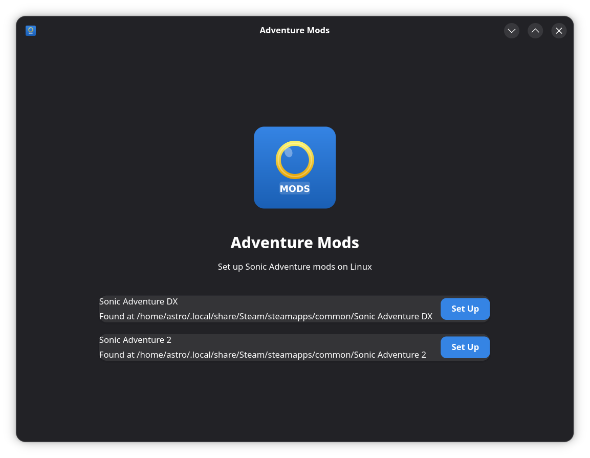
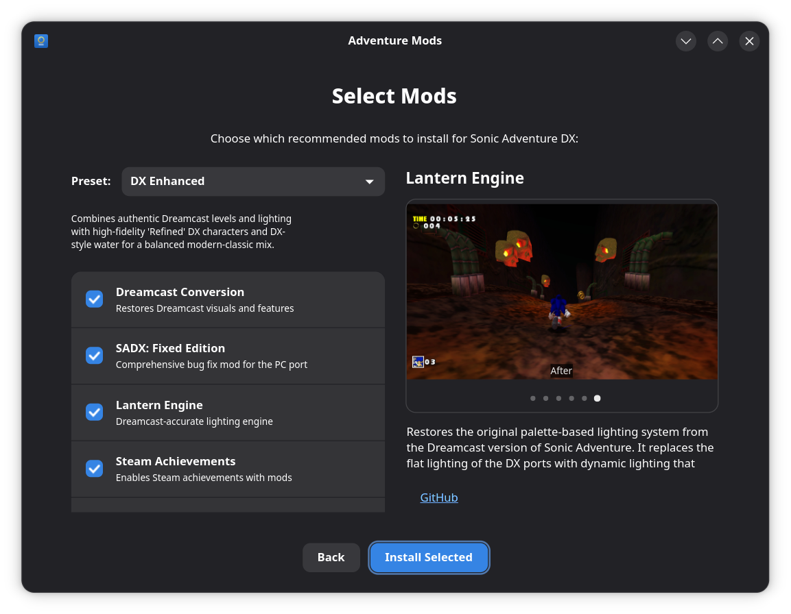

# Adventure Mods

A Linux desktop app for setting up Sonic Adventure DX and Sonic Adventure 2 mods with Steam and Proton.

Adventure Mods automates what would otherwise be a tedious manual process: installing mod managers, downloading recommended mods, configuring protontricks, and setting up .NET runtimes — all through a step-by-step GUI wizard.

## Screenshots

| Welcome | Mod Selection |
|---------|---------------|
|  |  |

## Features

- Automatic detection of SADX and SA2 Steam installations (including external drives)
- Step-by-step setup wizard for each game
- Automatic detection of native monitor resolution for game configuration
- .NET runtime configuration via protontricks
- Native mod installation for both games — no Windows installers needed
- SA Mod Manager installation for both SADX and SA2
- 19 curated SADX mods and 12 curated SA2 mods with per-mod selection
- Download progress tracking
- Works inside a Flatpak sandbox with host command support

## Requirements

- Steam with Sonic Adventure DX (71250) and/or Sonic Adventure 2 (213610) installed
- [protontricks](https://flathub.org/apps/com.github.Matoking.protontricks) (installed automatically if missing)

## Installation

### Flatpak (recommended)

```sh
flatpak-builder --user --install build build-aux/io.github.astrovm.AdventureMods.json
```

### From source

Install system dependencies:

```sh
# Debian/Ubuntu
sudo apt install libgtk-4-dev libadwaita-1-dev meson

# Fedora
sudo dnf install gtk4-devel libadwaita-devel meson

# Arch
sudo pacman -S gtk4 libadwaita meson
```

Build and install:

```sh
meson setup builddir
meson compile -C builddir
meson install -C builddir
```

Or build with Cargo directly (for development):

```sh
cargo build
```

## How It Works

1. **Game Detection** — Parses Steam's `libraryfolders.vdf` to find installed Sonic Adventure games
2. **Dependency Check** — Ensures protontricks is available, installing it from Flathub if needed
3. **Runtime Setup** — Installs .NET Desktop Runtime 8.0 and Visual C++ 2015-2022 via protontricks
4. **Mod Installation** — Configures native resolution and installs mod managers and curated mods
   - **SADX**: Installs the SADX Mod Loader, SA Mod Manager, and up to 19 recommended mods from dcmods, GameBanana, GitHub, and GitLab
   - **SA2**: Installs SA Mod Manager and up to 12 recommended mods from GameBanana

## Technology

- **Rust** with **GTK4** and **libadwaita** for a native GNOME desktop experience
- **Meson** build system with Cargo integration
- **Flatpak** sandbox with `flatpak-spawn --host` for protontricks and other host commands
- Mod downloads from **GameBanana**, **dcmods.unreliable.network**, **GitHub**, and **GitLab**

## License

[MIT](LICENSE)
