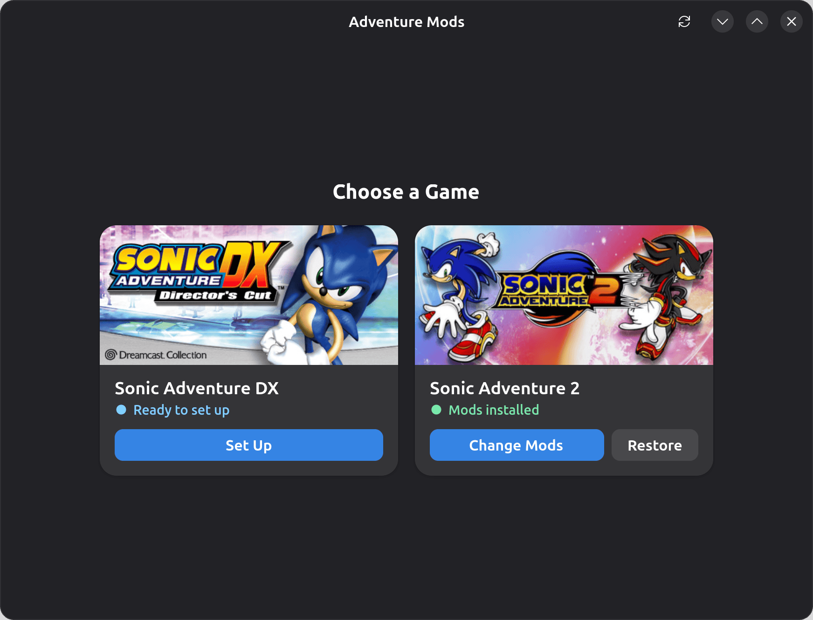
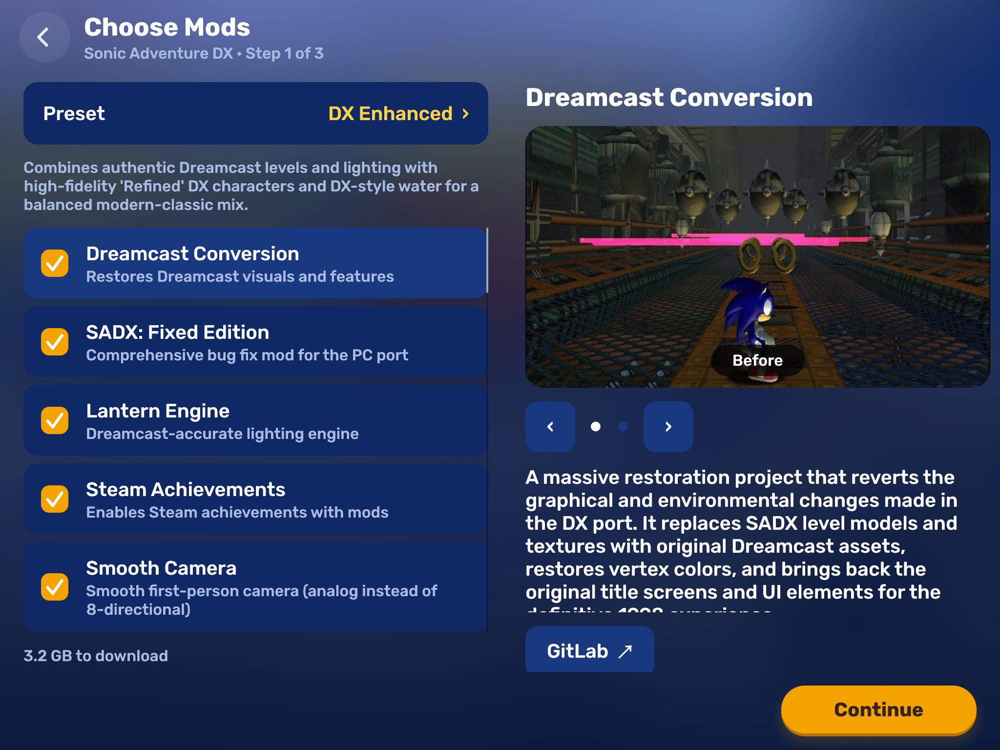
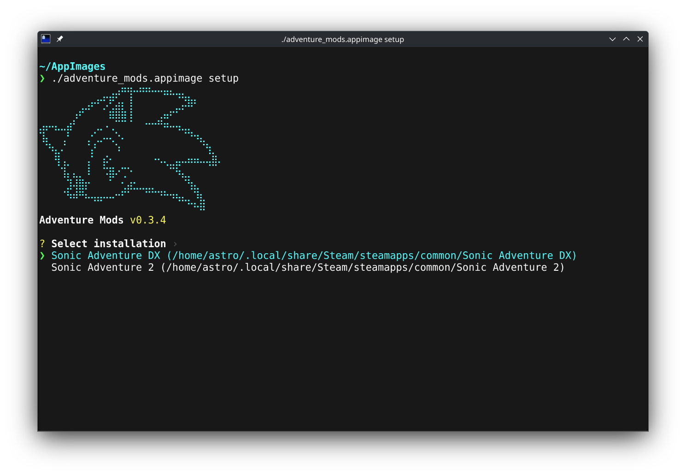

# Adventure Mods

**The easiest way to mod Sonic Adventure DX and Sonic Adventure 2 on Linux.**

It finds your Steam installs and downloads community mods. It also handles mod managers, runtimes, resolution, load order and language settings, so you can play right away.

<p align="center">
  
  &nbsp;&nbsp;
  
</p>

## Before you start

- **Steam** with Sonic Adventure DX (app 71250) and/or Sonic Adventure 2 (app 213610).
- **Proton 10.0.** Force it for each game under Properties → Compatibility.

Why Proton 10.0: Proton 11 and tools based on it (Hotfix, Experimental, many custom builds such as CachyOS) currently can't keep SA Mod Manager running.

## ⬇️ Install

**Flatpak (recommended)**

[Install Adventure Mods](https://flatpak.4st.li/apps/io.github.astrovm.AdventureMods/install/), or use the terminal:

```sh
flatpak install https://flatpak.4st.li/io.github.astrovm.AdventureMods.flatpakref
```

Update it later through your software manager or with:

```sh
flatpak update
```

<details>
<summary><b>Other options (AppImage, Snap)</b></summary>

**AppImage with Gear Lever**

[Install Gear Lever](https://flathub.org/apps/it.mijorus.gearlever/install), or use the terminal:

```sh
flatpak install https://dl.flathub.org/repo/appstream/it.mijorus.gearlever.flatpakref
```

Gear Lever handles desktop integration and updates.

Download the latest AppImage from [GitHub Releases](https://github.com/astrovm/AdventureMods/releases/latest) and open it with Gear Lever.

**AppImage manually**

```sh
chmod +x AdventureMods-v<version>-<arch>.AppImage
./AdventureMods-v<version>-<arch>.AppImage
```

Running it without a subcommand opens the app. Pass a subcommand for CLI mode.

**Snap**

Download the latest `.snap` from [GitHub Releases](https://github.com/astrovm/AdventureMods/releases/latest), then:

```sh
sudo snap install --dangerous --classic AdventureMods-v<version>-<arch>.snap
```

It uses classic confinement, so it can reach every Steam library and run Proton. Snap won't update it on its own: install a newer `.snap` the same way.

</details>

## 🚀 Use

Open **Adventure Mods** from your application menu and follow the setup wizard.

It works with a controller too, so you can use it from the couch or in Steam Deck's Game Mode (add it to Steam as a non-Steam game). The D-pad or left stick moves, **A** selects, **B** goes back and **Start** continues.

## Features

- **Finds your games.** Detects SADX and SA2 across all Steam library folders.
- **Lots of mods.** Includes 29 SADX mods and 12 SA2 mods.
- **SADX presets.** DX Enhanced and Dreamcast Restoration.
- **One step.** Installs mod managers, mods and dependencies together.
- **Good settings.** Sets native resolution, window mode and optimal settings.
- **Your languages.** Saves subtitle and voice language per game.
- **Couch friendly.** Big text and buttons, with full controller support.

## CLI (optional)

<p align="center">
  
</p>

The graphical app is recommended for most people. From a terminal, start with the interactive setup wizard:

```sh
flatpak run io.github.astrovm.AdventureMods setup
```

- **Interactive by default.** It walks you through game selection, mods and install steps.
- **Scriptable.** Leave out game or mod flags to stay interactive. Pass them only for a fully non-interactive run.

<details>
<summary><b>Other commands</b></summary>

| Command                      | What it does                                                 |
| ---------------------------- | ------------------------------------------------------------ |
| `detect`                     | Show detected game installs and inaccessible Steam libraries |
| `list-mods --game sadx\|sa2` | List available presets and mods for a game                   |

```sh
flatpak run io.github.astrovm.AdventureMods detect
flatpak run io.github.astrovm.AdventureMods list-mods --game sadx
flatpak run io.github.astrovm.AdventureMods --help
```

</details>

<details>
<summary><b>Non-interactive setup options</b></summary>

Use these with `setup` for scripting. When game, path or mod selection is left out, `setup` stays interactive.

| Flag                         | What it does                                 |
| ---------------------------- | -------------------------------------------- |
| `--game sadx\|sa2`           | Select the game                              |
| `--game-path /path`          | Override Steam detection                     |
| `--preset "Name"`            | Named preset (SADX only)                     |
| `--all-mods`                 | Install all recommended mods                 |
| `--mods slug1,slug2`         | Install specific mods by slug                |
| `--subtitle-language`        | Select subtitles                             |
| `--voice-language`           | Select `japanese` or `english` voices        |
| `--width`, `--height`        | Override the detected resolution             |
| `--libraryfolders-vdf /path` | Use a specific `libraryfolders.vdf` file     |
| `--steam-library /path`      | Add an extra Steam library root (repeatable) |

Subtitle languages:

| Game | Languages                                                         |
| ---- | ----------------------------------------------------------------- |
| SADX | `japanese`, `english`, `french`, `spanish`, `german`              |
| SA2  | `english`, `german`, `spanish`, `french`, `italian`, `japanese`   |

```sh
flatpak run io.github.astrovm.AdventureMods setup --game sadx --preset "DX Enhanced"
flatpak run io.github.astrovm.AdventureMods setup --help
```

</details>

<details>
<summary><b>Development</b></summary>

**Flatpak** (Devel manifest, installs for the current user)

```sh
make flatpak
```

Production manifest: `make flatpak FLATPAK_MANIFEST=build-aux/io.github.astrovm.AdventureMods.json`

The Flatpak build downloads the Cargo.lock dependencies during the build.

**AppImage** (Podman + `ubuntu:26.04`, matching the CI runner)

```sh
make appimage
```

Output: `appimage-build/AdventureMods-v<version>-<arch>.AppImage` and `.zsync`.

Builds match the host architecture (x86_64 or aarch64). GitHub Releases publish both.

</details>
